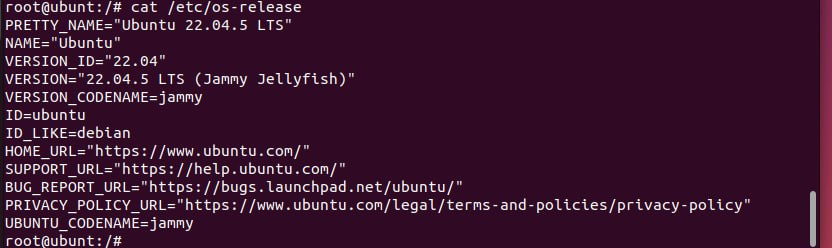
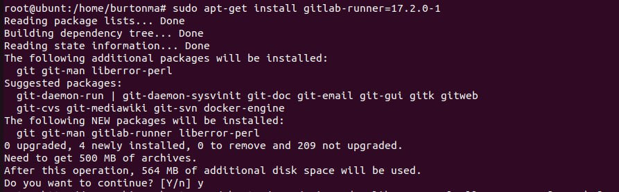
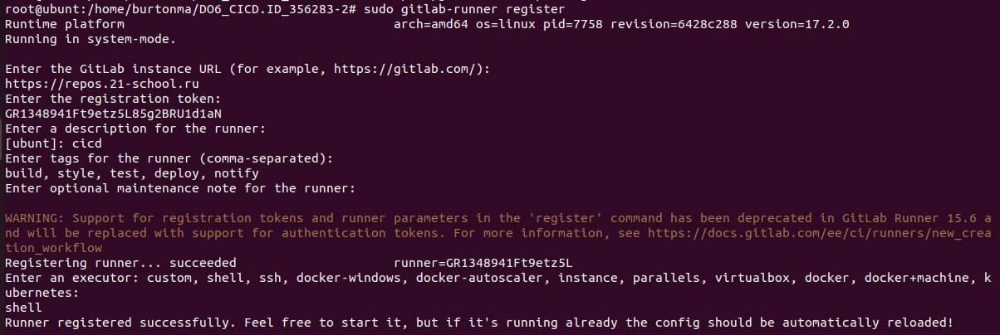
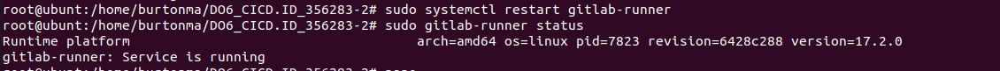
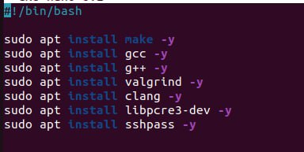
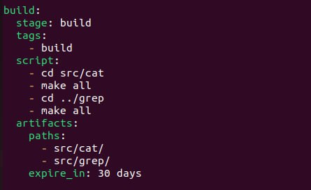

## Part 1. Настройка gitlab-runner

**Подняла виртуальную машину Ubuntu Server 22.04 LTS.**

**Скачала и установила на виртуальную машину gitlab-runner**

**Запустила gitlab-runner и зарегистрировала его для использования в текущем проекте (DO6_CICD)**

**Перезапустила и убедилась, что сервис активен**

## Part 2. Сборка

**Скачивание дополнительных утилит**

**В файле gitlab-ci.yml добавила этап запуска сборки через мейк файл из проекта C2`**

**Запушила изменения и проверила пайплайн**

## Part 3. Тест кодстайла

**Написала этап для CI, который запускает скрипт кодстайла (clang-format)**

**Пример удачной сборки**

**Пример неудачной сборки - Если кодстайл не прошел, то «зафейлен» пайплайн**

## Part 4. Интеграционные тесты

**Написала этап для CI, который запустит интеграционные тесты**

**Если тесты не прошли, то пайплайн «фейлится»:**

**Пример успешного прохода тестов**

## Part 5. Этап деплоя

**Задала машинам статические ip адреса и прописала маршруты для их связи**

**Для целей выполнения задания нужно, чтобы раннер с первой ВМ получал беспарольный доступ на вторую ВМ. Для этого на первой ВМ нужно зайти в пользователя раннера(gitlab-runner) и сгенерировать от его лица ssh-ключ, после чего перенести его на вторую ВМ**

**Написала bash-скрипт, который при помощи ssh и scp копирует файлы, полученные после сборки (артефакты), в директорию /usr/local/bin второй виртуальной машины**

**Дополнила файл .gitlab-ci.yml следующими строками**

**Проверка, что есть запуск вручную и успешное прохождение этапа**

**В результате получаю готовые к работе приложения из проекта C2**

## Part 6. Дополнительно. Уведомления

**Создаю новый бот через @BotFather, после чего получаю id токена**

**Через @userinfobot узнаем  id своего чата:**

**Создала файл скрипта и дала ему права на исполнение chmod +x bot.sh**

**Дополняю файл gitlab-ci.yml**

**Проверка через docker images, что все собралось корректно командой`sudo docker images`**

**Успешное прохождение пайплайна и получение уведомлений через бота**

